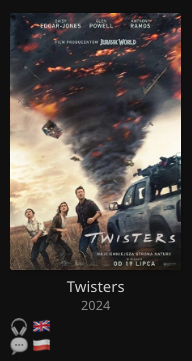
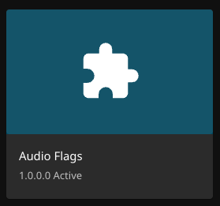

<h1 align="center">🎧 Audio Flags 💬</h1>
<p align="center"><b>Jellyfin plugin — language flags under every card</b><br/>
<sub>Audio + subtitle flag emoji rendered directly on library posters.</sub></p>

<p align="center">
  <a href="https://github.com/foxtrotdev/jellyfin-plugin-audio-flags/actions"></a>
  <a href="LICENSE"></a>
  <a href="https://jellyfin.org/"></a>
  <a href="https://github.com/foxtrotdev/jellyfin-plugin-audio-flags/releases"></a>
</p>

<p align="center">
  
  &nbsp;&nbsp;
  
  &nbsp;&nbsp;
  
</p>

```
[ poster ]
Title (2024)
🎧 🇵🇱 🇬🇧
💬 🇵🇱 🇬🇧 🇩🇪
```

## Installation

### Option A — Plugin Catalog (recommended)

1. Open Jellyfin Dashboard → **Plugins** → **Repositories** → **Add**.
2. Repository URL:
   ```
   https://raw.githubusercontent.com/foxtrotdev/jellyfin-plugin-audio-flags/main/manifest.json
   ```
   Give it any name (e.g. `foxtrotdev`).
3. Go to **Catalog**, find **Audio Flags**, click **Install**.
4. Restart Jellyfin.
5. Hard-refresh the web client (`Ctrl/Cmd + Shift + R`) — the plugin injects a `<script>` into `web/index.html`, so the browser cache needs to clear.

### Option B — Manual install

1. Download the latest `.zip` from the [Releases page](https://github.com/foxtrotdev/jellyfin-plugin-audio-flags/releases).
2. Extract it into Jellyfin's plugin folder under a subdirectory named `AudioFlags`.
3. Restart Jellyfin.
4. Hard-refresh the web client.

### Plugin folder locations

| OS                | Path                                                              |
|-------------------|-------------------------------------------------------------------|
| Linux (deb/rpm)   | `/var/lib/jellyfin/plugins/AudioFlags/`                           |
| Linux (Docker)    | `/config/plugins/AudioFlags/` (inside the container)              |
| macOS             | `~/.local/share/jellyfin/plugins/AudioFlags/` or the app data dir |
| Windows           | `%ProgramData%\Jellyfin\Server\plugins\AudioFlags\`               |

## How it works

- Server-side plugin written for .NET 8, targeting Jellyfin's plugin API.
- On startup the plugin injects a `<script>` tag into `web/index.html` pointing at `/AudioFlags/ClientScript`.
- The client script scans the DOM for `.card[data-id]` / `.listItem[data-id]` elements and **batches** IDs (40 per request) against `/Users/{uid}/Items?Ids=...&Fields=MediaStreams,MediaSources`.
- Each track's language code (ISO 639-1 / 639-2) is mapped to a country (ISO 3166-1 alpha-2) and rendered as a regional-indicator flag emoji.
- Flags are inserted as a single row directly under the card's title.

## Configuration

Open **Dashboard → Plugins → Audio Flags**. Four toggles:

- **Show audio flags** (🎧) — render the audio-language row.
- **Show subtitle flags** (💬) — render the subtitle/CC-language row.
- **English uses GB flag** — when on, English tracks show 🇬🇧; when off, 🇺🇸.
- **Debug logging** — verbose logging in the browser console (helpful when filing issues).

## Building from source

Requirements: **.NET 8 SDK**.

```bash
cd Jellyfin.Plugin.AudioFlags
dotnet publish -c Release -o ./out
```

Copy `out/Jellyfin.Plugin.AudioFlags.dll` into your Jellyfin plugins folder (see table above), then restart Jellyfin.

## Compatibility

- **Jellyfin:** 10.10 and 10.11.
- **Web client:** works against both the Vue and React-based web clients.
- **Browser cache:** after a Jellyfin server upgrade, `index.html` is replaced and the plugin re-injects on next start — clients still need a **hard refresh** to pick up the new script tag.

## Troubleshooting

- **No flags appear.** Enable Debug logging in the config page, open the browser DevTools console, and check for `401`/`403` responses or JS errors. The script must be reachable at `/AudioFlags/ClientScript`.
- **Flags disappeared after a Jellyfin upgrade.** The upgrade replaced `web/index.html`. Restart the plugin (or the server) — it will re-inject the `<script>` tag on next startup. Then hard-refresh the browser.
- **Wrong English flag (US vs UK).** Toggle the **English uses GB flag** option in the plugin config.
- **Tracks tagged `und` / `mul` / `zxx`** render as a neutral 🏳 — they have no defined language.

## Contributing

Bug reports, fixes, and language-mapping improvements are welcome. See [CONTRIBUTING.md](CONTRIBUTING.md).

## License

[MIT](LICENSE) © 2026 foxtrotdev.
